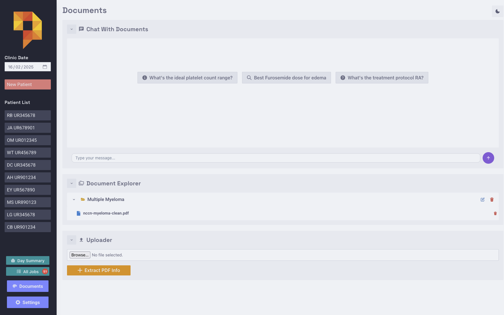
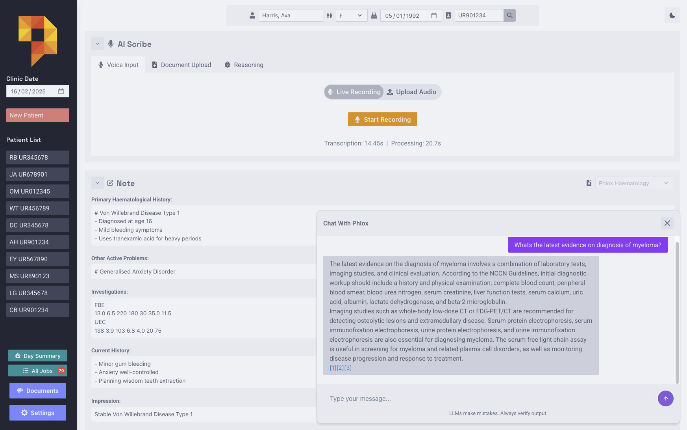
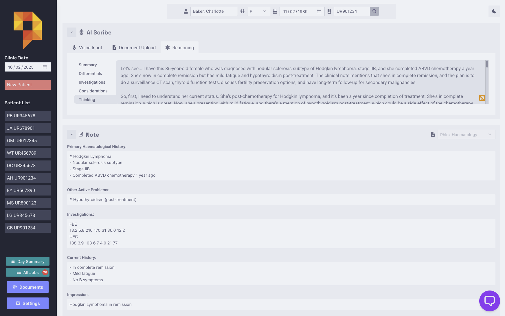

# AI Features

Phlox includes a few ways to chat with documents and clinical notes using LLMs:

## Document Chat
Chat with uploaded medical documents and guidelines:

1. Upload PDFs to collections in the Document Explorer
2. Ask questions about the documents
3. Get responses with citations to specific document sources

## Reference Chat
Query medical literature and guidelines alongside your notes:

1. Click chat icon in patient view
2. Ask reference questions to clarify terminology or guidelines
3. LLM references the clinical note content in responses
4. The LLM will also make a tool call to the RAG database if required

## Educational Case Review (Clinical Reasoning)
Generate a simulated peer-review and literature correlation for the current encounter. This feature acts as a dynamic textbook or "curbside consult" to broaden your consideration set:

1. After creating a clinical note, click "Generate Reasoning"
2. The LLM acts as an educational sounding board, analyzing the text to provide:
   - **Case Summary:** A brief synthesis of the documented encounter.
   - **Literature Correlations (Differentials):** A list of conditions commonly associated with the documented symptoms in medical literature.
   - **Standard Workup References (Investigations):** Typical investigations associated with the correlated conditions.
   - **Documentation QA (Considerations):** Highlights potential gaps in the documentation or "red flags" that might need explicit addressing in the note.
3. Review the AI's educational suggestions.
4. Use this as a prompt to ensure your documentation is comprehensive and you haven't anchored prematurely.

**Note:** This feature is strictly an educational and documentation-quality tool. It is NOT a diagnostic tool and does not provide clinical decision support.

## Adaptive Refinement

Phlox learns your documentation preferences over time to improve note quality:

1. Edit generated content in any template field
